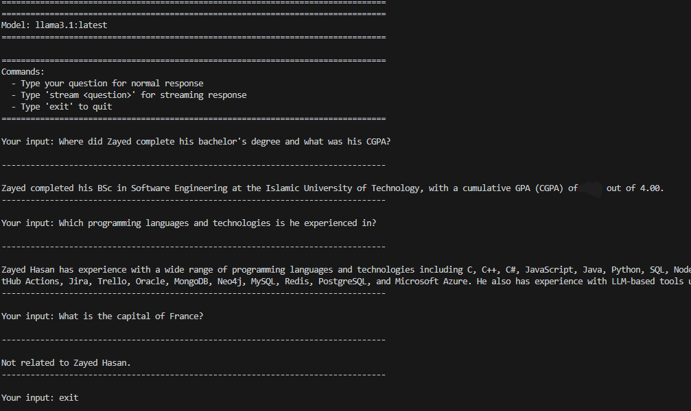

# Personal Profile Q&A System

An AI-powered Q&A system that answers questions specifically about a particular person's professional profile — their education, work experience, skills, and projects. Ask it anything about the profile owner's background, and it will give you a precise, natural answer. Ask it something unrelated, and it will simply tell you it can't help with that.

No cloud. No API keys. Everything runs locally on your machine.

---

## 📸 Screenshots



---

## 📌 What Does It Do?

Instead of someone reading through a resume or profile document manually, they can just ask questions like:

- *"Where did he study?"*
- *"What is his current job?"*
- *"What programming languages does he know?"*
- *"What projects has he built?"*
- *"What is his CGPA?"*

And the system will respond with a clear, accurate, human-readable answer — pulled directly from the profile data.

If someone asks something completely unrelated like *"What is the capital of France?"*, the system will simply respond that the question is not related to the profile — it strictly stays within scope.

---

## 🗂️ Folder Structure

```
ProfileRAG/
│
├── data/
│   └── aboutme.txt                      # Personal profile data (see note at bottom)
│
├── vector_store_claude/
│   └── chroma_profile_db/               # Auto-generated search database
│
├── indexing_ultimate.py                 # Reads the profile and builds the search database
├── rag_ollama.py                        # Runs the Q&A system
├── requirements.txt                     # Python dependencies
│
└── README.md
```

---

## ⚙️ Tech Stack

| Component | Technology |
|---|---|
| Embeddings | `sentence-transformers/all-mpnet-base-v2` (HuggingFace) |
| Vector Store | ChromaDB |
| Lexical Search | BM25 (via LangChain) |
| LLM | Llama 3.1 (via Ollama, runs locally) |
| Framework | LangChain |
| Language | Python |

---

## 🧩 How Indexing Works (`indexing_ultimate.py`)

Before the Q&A system can run, the profile document needs to be processed and stored in a searchable format. This is what the indexing script does.

It reads `aboutme.txt` and splits it into logical sections based on the headers in the document (like `EDUCATION`, `WORK EXPERIENCE`, `SKILLS`, etc.). Each section is kept as its own chunk so that when a question is asked, the system can find and return the most relevant part of the profile — not the whole document.

These chunks are then converted into embeddings that allows the system to understand meaning, not just keywords. Everything is saved locally to disk so indexing only needs to be done once.

---

## 🔍 How Retrieval Works (`rag_ollama.py`)

When a question is asked, the system goes through several steps to find the best answer:

**Step 1 — Understanding the question:** The system first figures out what topic the question is about. Is it asking about education? Work? Skills? Projects? This helps it prioritize the right parts of the profile.

**Step 2 — Expanding the question:** The system automatically enriches the question with related terms. For example, a question about *"university"* also searches for *"degree"*, *"bachelor"*, *"CGPA"*, and so on — making sure nothing relevant is missed. And It Does this by Using *"relevant synonyms"*.

**Step 3 — Searching in two ways simultaneously:** The system searches the profile using both meaning-based search (finds semantically similar content) and keyword-based search (finds exact term matches). Both methods run together and their results are combined for better accuracy.

**Step 4 — Ranking and selecting the best results:** All the retrieved pieces of the profile are scored and ranked. Sections that match the detected topic of the question are given a higher priority score, pushing the most relevant content to the top.

**Step 5 — Generating the answer:** The top results are handed to a locally running Llama 3.1 model, which reads them and writes a clean, complete answer in natural language. The model is strictly instructed to only use the provided profile content — it cannot make things up or go off-topic.

---

## 🚀 Setup & Usage

### Prerequisites
- Python 3.9+
- [Ollama](https://ollama.com/) installed, then pull the model:
  ```bash
  ollama pull llama3.1:latest
  ```

### Install Dependencies
```bash
pip install -r requirements.txt
```

### Step 1 — Index the Profile
Run this once to process `data/aboutme.txt` and build the search database:
```bash
python indexing_ultimate.py
```

### Step 2 — Start the Q&A System
```bash
python rag_ollama.py
```

Then just type your questions:
```
Your input: Where does he work?
Your input: What is his CGPA?
Your input: What programming languages does he know?
Your input: What is the capital of France?   →  "Not related to the profile."
Your input: exit
```

---

## ⚠️ Important Notes

> **Name in source code:** The real name used inside the system prompt in `rag_ollama.py` has been removed for privacy in this public repo. Replace it with the actual name before running locally.

> **`aboutme.txt` is empty in this repo:** The profile data file is intentionally left blank to protect personal information. To use the system, fill it with a profile document that uses ALL-CAPS section headers like `EDUCATION`, `SKILLS`, `WORK EXPERIENCE`, etc.

---

## 👤 Author

**Zayed Hasan**  
Software Engineer | GitHub: [Zayed53](https://github.com/Zayed53)